# Installation et Configuration de l'extension My Flying Box pour WooCommerce

## Table des matières

- [Prérequis](#prérequis)
- [Téléchargement](#téléchargement)
- [Installation](#installation)
- [Configuration](#configuration)
  - [Compte d'API My Flying Box](#compte-dapi-my-flying-box)
  - [Paramétrage de l'expéditeur par défaut](#paramétrage-de-lexpéditeur-par-défaut)
  - [Chargement des produits transporteurs](#chargement-et-sélection-des-produits-transporteurs)
  - [Configuration des produits](#configuration-des-produits)
  - [Configuration des zones d'expéditions](#configuration-des-zones-dexpéditions)
- [Passage en production](#passage-en-production)

## Prérequis

* Une installation fonctionnelle de Wordpress avec l'extension Woocommerce.
* Un compte My Flying Box avec une ligne de crédit ou du crédit chargé par carte bancaire : [https://dashboard.myflyingbox.com/fr/registrations/new](https://dashboard.myflyingbox.com/fr/registrations/new)
* **Attention** : A partir de la version 8.2 de WooCommerce, le High-Performance Order Storage est activé par défaut. Cette fonctionnalité n'est supportée qu'à partir de la version 0.17 de l'extension My Flying Box.

## Téléchargement

1. Se rendre sur la page github de l'extension : [https://github.com/myflyingbox/woocommerce-plugin](https://github.com/myflyingbox/woocommerce-plugin)

2. Cliquer sur la version la plus récente de l'extension.

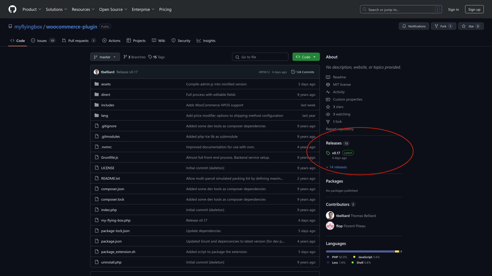

3. Télécharger le fichier zip de l'extension sur votre ordinateur. Il s'agit du premier fichier dans la liste avec un nom du type woocommerce-myflyingbox-vX.YY.zip

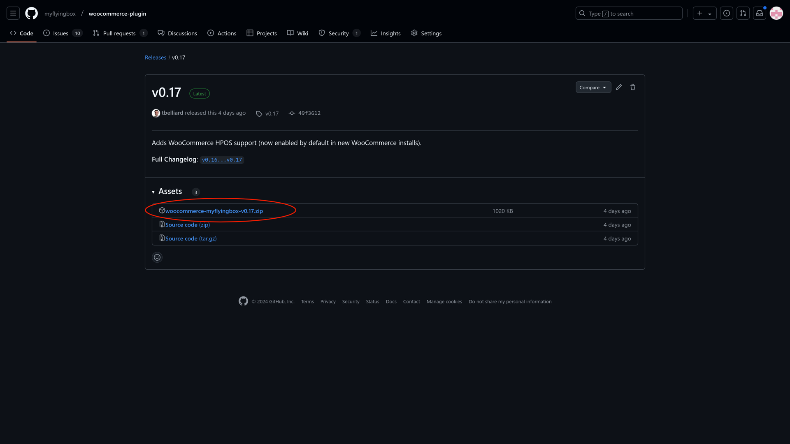

## Installation

1. Se rendre sur l'admin de votre WordPress. (par ex : [https://www.maboutique.com/wp-admin](https://www.maboutique.com/wp-admin) ).

2. Cliquer sur "Ajouter une extension" dans "Extensions" puis "Téléverser une extension".

3. Choisir le fichier zip de l'extension téléchargé précédemment puis cliquer sur "Installer maintenant".

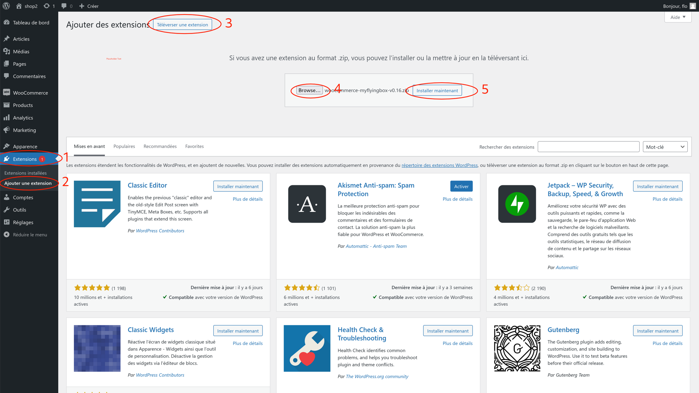

4. Activer l'extension.

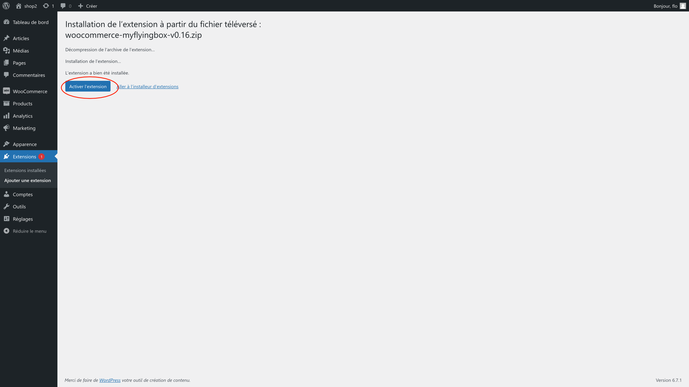

## Configuration

### Compte d'API My Flying Box

1. Récupérer vos identifiants et mots de passe d'API My Flying Box via le dashboard : [https://dashboard.myflyingbox.com/fr/dashboard/api#api-accounts](https://dashboard.myflyingbox.com/fr/dashboard/api#api-accounts)

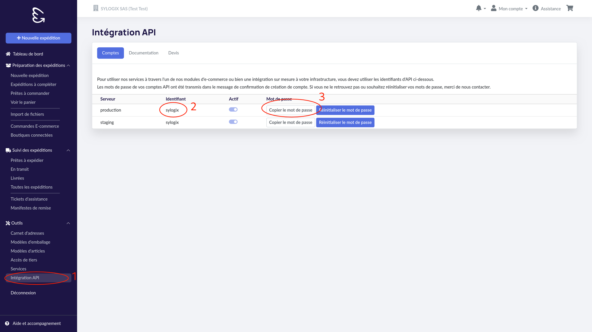

2. Choisir le serveur d'API. Afin de faire des tests ou si votre compte My Flying Box n'est pas encore validé, vous pouvez utiliser le serveur "Staging". **Attention**, les services et les prix sur le serveur de staging ne sont pas toujours équivalent à ceux sur le serveur de production.

3. Copier les identifiants dans les paramètres du compte de l'extension My Flying Box

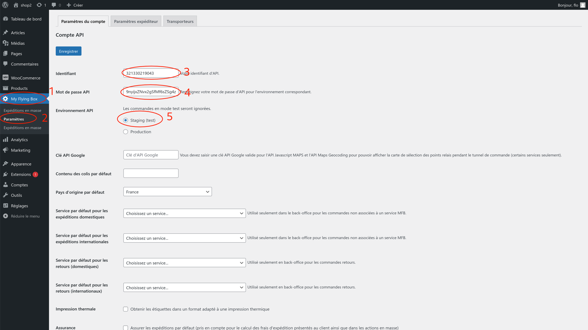

4. Enregistrer les changements

### Paramétrage de l'expéditeur par défaut

1. Aller dans l'onglet Paramètres expéditeur

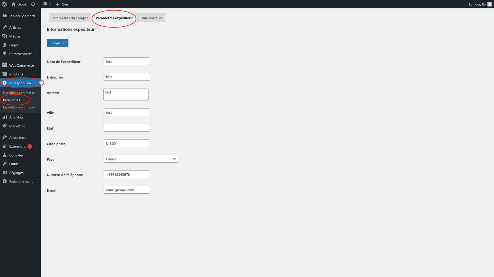

2. Saisir l'adresse de l'expéditeur. C'est l'adresse par défaut qui sera utilisée pour créer les expéditions.

3. Enregistrer les changements.

### Chargement et sélection des produits transporteurs

1. Aller sur l'onglet Transporteurs.

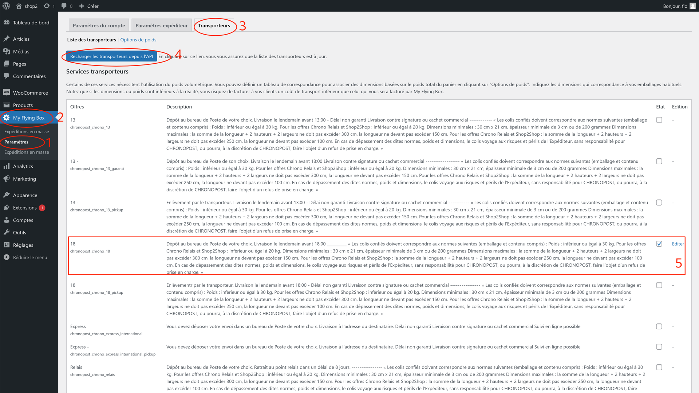

2. Cliquer sur Recharger les transporteurs depuis l'API. **Attention** Les étapes précédentes ( [Compte d'API My Flying Box](#compte-dapi-my-flying-box) et [Paramétrage de l'expéditeur par défaut](#paramétrage-de-lexpéditeur-par-défaut) ) sont nécessaires afin de pouvoir charger la liste de produits disponibles.

3. Cocher les services transporteurs que vous souhaitez utiliser. Ces services seront ensuite disponibles comme Modes d'expédition dans WooCommerce. N'hésitez pas à utiliser le dashboard My Flying Box pour faire des tests et voir les produits disponibles pour les routes de vos clients ( [https://dashboard.myflyingbox.com/fr/dashboard/draft_shipments/new](https://dashboard.myflyingbox.com/fr/dashboard/draft_shipments/new) )

4. Enregistrer les changements. **Attention** La liste de services peut être très longue et le bouton Enregistrer est tout en bas de la page.

### Configuration des produits

1. Se rendre sur la page Produits.

2. Modifier les produits et d'assurer que tous les produits aient un poids dans l'onglet Expédition de la zone Donnée produit.

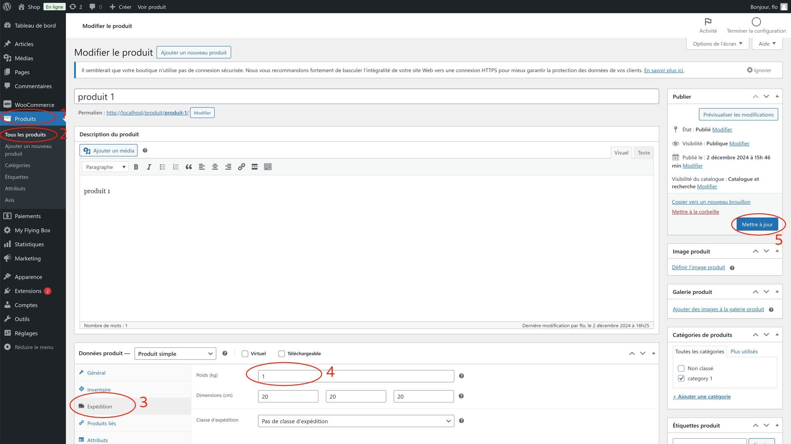

### Configuration des zones d'expéditions

1. Se rendre sur l'onglet Expédition dans la page Réglages de l'extension WooCommerce.

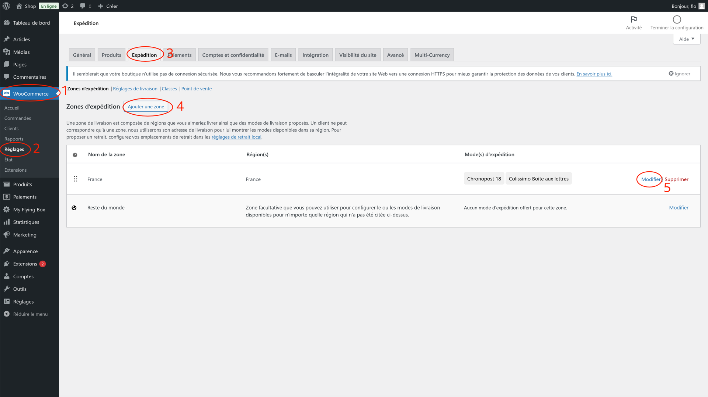

2. Créer les Zones d'expédition afin de créer les correspondance entre les pays de livraison et les services que vous souhaitez proposer à vos clients. Les [services sélectionnés précédement](#chargement-et-sélection-des-produits-transporteurs) seront disponibles dans les Modes d'expédition.

3. En cliquant Modifier sur les Modes d'expédition, vous pouvez personnaliser leurs fonctionnements. Par exemple, pour nommer les services pour vos clients.

4. Enregistrer les modifications.

5. A partir de ce point, vous pouvez tester le processus d'achat sur votre boutique. Les services configurés vont apparaître dans le tunnel d'achat des paniers.

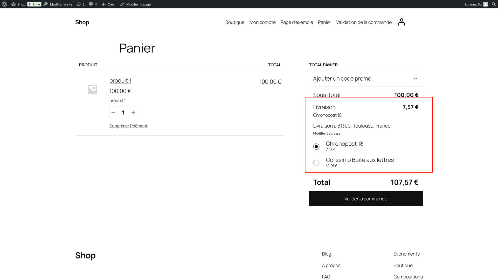

## Passage en production

1. Si votre compte de production n'est pas actif sur le [dashboard My Flying Box](https://dashboard.myflyingbox.com/fr/dashboard/api#api-accounts) n'hésitez pas à demander son activation à notre service de support.

2. S'assurer que votre méthode de paiement est en place sur votre dashboard ou [crédit votre compte via carte bancaire](https://dashboard.myflyingbox.com/fr/dashboard/transactions)

3. Si n'est pas déjà fait, changer vos identifiants pour utiliser ceux de production. Voir [étape précédente](#compte-dapi-my-flying-box)
